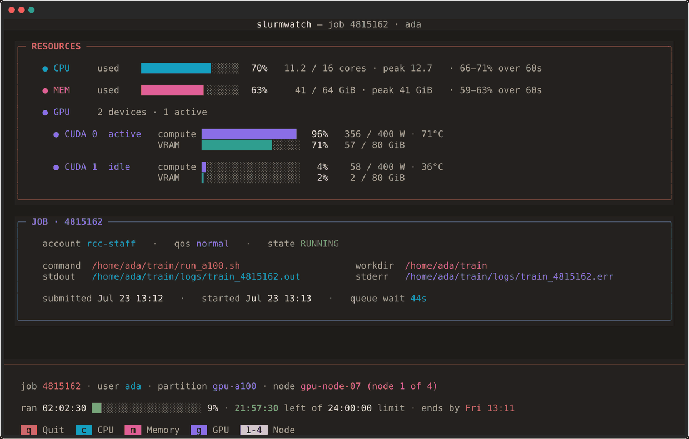

# slurmwatch

Live, process-isolated node-local hardware telemetry for active Slurm jobs.

Monitor CPU, memory, and GPU utilization of running Slurm jobs in real time,
with per-process GPU attribution and allocation-efficiency analysis.

<p align="center">
  
</p>

## Requirements

- **Python 3.10+**
- **Slurm compute node** — slurmwatch must run on a node where the job is actively
  running (login nodes and non-compute nodes will not have the job's cgroup filesystem).
- **Linux** with cgroup v1 or v2
- **NVIDIA GPU monitoring** (optional): `pip install slurmwatch[nvidia]`

## Installation

```bash
pip install slurmwatch

# With NVIDIA GPU support:
pip install "slurmwatch[nvidia]"
```

## Quick Start

```bash
# Attach to a running job (interactive TUI)
slurmwatch <job_id>

# Auto-discover running jobs
slurmwatch

# Run with simulated demo data (no Slurm needed)
slurmwatch --demo

# One-shot snapshot to stdout
slurmwatch <job_id> --once

# Headless logging
slurmwatch <job_id> --log metrics.jsonl

# Headless CSV logging
slurmwatch <job_id> --log metrics.csv
```

## Usage

**Important:** slurmwatch must run on a compute node where the job is executing.
Use `srun --jobid <job_id> --overlap slurmwatch <job_id>` if needed.

### Interactive TUI

| Key | Action |
|-----|--------|
| `c` | Focus CPU panel |
| `m` | Focus Memory panel |
| `g` | Focus GPU panel |
| `v` | Focus Allocation Verdict |
| `q` / `Escape` | Quit |
| `Up` / `Down` | Scroll |
| `PgUp` / `PgDn` | Page scroll |

### Headless Mode

Write telemetry as JSON Lines or CSV:

```bash
slurmwatch 12345 --log metrics.jsonl
slurmwatch 12345 --log metrics.csv

# In a batch script:
slurmwatch $SLURM_JOB_ID --log "${SLURM_JOB_ID}.jsonl" &
```

Job-array tasks are fully supported:

```bash
slurmwatch 12345_3          # Attach to array task 3 of job 12345
slurmwatch 12345_\[1-10\]   # Attach to array job 12345 (all tasks)
```

### Environment Variables

| Variable | Default | Description |
|----------|---------|-------------|
| `SLURMWATCH_MOCK=1` | — | Enable demo/simulation mode (no Slurm needed) |
| `SLURMWATCH_POLL_INTERVAL` | `0.5` | TUI polling interval in seconds |
| `SLURMWATCH_HEADLESS_INTERVAL` | `1.0` | Headless polling interval in seconds |
| `SLURMWATCH_OOM_WARN` | `0.85` | Memory OOM warning threshold (fraction of limit) |
| `SLURMWATCH_OOM_CRIT` | `0.90` | Memory OOM critical threshold (fraction of limit) |
| `SLURMWATCH_HISTORY_SECONDS` | `60` | Sparkline history length in seconds |
| `SLURMWATCH_CPU_UNDERUSE` | `0.5` | Flag CPU underuse below this many effective cores |
| `SLURMWATCH_GPU_IDLE_PCT` | `5.0` | Per-process GPU utilization (%) below which a GPU counts as idle |
| `SLURMWATCH_ASCII` | `0` | Use ASCII-only characters (`1` or `true`) |
| `SLURMWATCH_FORMAT` | — | Force `--log` output format (`json` or `csv`) |

## What It Does

### CPU
- Real-time utilization as a percentage of the allocated CPUs
- **Effective cores** readout — how many cores are actually being used (1.2 / 16 means
  ~1.2 cores' worth of work on a 16-core allocation)
- Underutilization warnings when effective cores < 2 on a multi-core allocation

### Memory
- **Working set** tracking — subtracts reclaimable page cache from `memory.current`
  to show actual job memory usage
- Peak memory tracking (with fallback on kernels < 5.19 that lack `memory.peak`)
- OOM guard with configurable warning/critical thresholds
- Falls back to node physical RAM when cgroup limit is unlimited

### GPU (NVIDIA only, requires `pynvml`)
- **Per-process GPU attribution** — reads the job's PIDs from cgroup and uses
  `nvmlDeviceGetComputeRunningProcesses` and `nvmlDeviceGetGraphicsRunningProcesses`
  to attribute only this job's GPU memory usage
- **Per-process SM utilization** via `nvmlDeviceGetProcessUtilization`
- Device-wide utilization, VRAM usage, power, and temperature
- Genuine throttling detection (hardware clock slowdown, power brake, thermal events)
- "Requested vs used" comparison for GPUs

### Allocation Verdict
- Summary panel showing whether CPU, memory, and GPU resources are being used optimally
- Flagged underutilization: idle GPUs, single-core workloads on large allocations,
  negligible memory pressure

## Output Formats

### JSON Lines (default)
```json
{"timestamp": 1705312234.567, "job_id": "12345", "hostname": "cn001", ...}
```

### CSV
```
timestamp,job_id,hostname,elapsed_seconds,cpu_cores,cpu_percent,cpu_effective_cores,...
1705312234.567,12345,cn001,3600,16,45.50,7.28,...
```

## Limitations

- **NVIDIA-only** — AMD GPUs not currently supported
- **Single-node** — monitors only the local node; multi-node jobs show per-node data
- **GPU process isolation** requires running on the same node as the job (cgroup access)

## License

MIT
